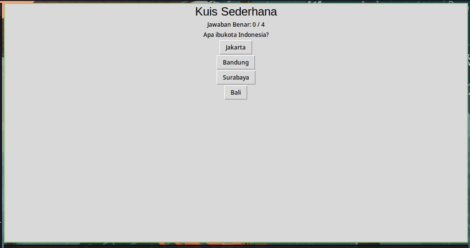

<h1 align="center">Simple Python GUI (Tkinter) Programs</h1>

these are just some of my little experiments trying out the Python GUI using Tkinter.



## How to run the program

1. Download code as zip above and extract to your computer

   Or, clone the repository

```bash
git clone https://github.com/jo0707/python-gui-test.git
```

2. Open the folder in your code editor (VSCode, PyCharm, vim, etc.)

3. Open the terminal and install tkinter

   - Windows

   ```bash
   pip install tk
   ```

   - Linux (Debian/Ubuntu based)

   ```bash
   sudo apt-get install python3-tk
   ```

   - Linux (Fedora based)

   ```bash
   sudo dnf install python3-tkinter
   ```

   - Linux (Arch based)

   ```bash
   sudo pacman -S tk
   ```

   - MacOS

   ```bash
   brew install python-tk
   ```

4. Run the program (you can run the program in the terminal or in your code editor)

   ```bash
   python main.py
   ```

   or

   ```bash
   python calculator.py
   ```

   etc...

## Collaborating

Feel free to commit your programs here! Just fork the repository and make a pull request :)
